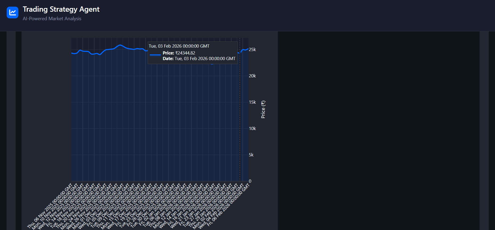

# 📈 AI Trading Strategy Agent

**An AI-powered trading strategy system for intelligent market analysis and data-driven investment decisions**

[](https://www.python.org/downloads/)
[](https://flask.palletsprojects.com/)
[](https://opensource.org/licenses/MIT)

---

## 🔍 Overview

The **AI Trading Strategy Agent** is an intelligent system designed to analyze financial market data and generate automated trading strategies using Artificial Intelligence. The system helps users make data-driven trading decisions using technical indicators and machine learning models.

The system provides:

* 📊 **Fetches** real-time market data from multiple sources
* 📈 **Calculates** technical indicators (RSI, MACD, Moving Averages)
* 🤖 **Generates** AI-powered trading signals (BUY/SELL/HOLD)
* 📉 **Backtests** strategies using historical data
* 💹 **Visualizes** results through interactive charts
* 💰 **Displays** all prices in INR (₹) with live conversion

This project demonstrates practical **AI-driven trading analysis**, combining technical analysis, strategy generation, and performance visualization.

---

## 🎯 Key Features

* **📊 Dual Data Sources**: yfinance + Alpha Vantage API for maximum reliability
* **📈 Technical Indicators**: RSI, MACD, Moving Averages, Bollinger Bands
* **🤖 AI Strategy Generation**: Intelligent BUY/SELL/HOLD recommendations with confidence scores
* **📉 Advanced Backtesting**: Historical performance analysis with 10+ metrics
* **💾 PostgreSQL Database**: Persistent storage for strategies and results
* **🖥️ Interactive Dashboard**: Modern dark-themed web interface with real-time charts
* **💰 INR Currency Support**: All prices converted to Indian Rupees (₹)
* **🔒 Secure Configuration**: Environment-based API key management

---

## 🏗️ System Architecture

```
┌─────────────────────────────┐
│     Financial Data APIs     │
│  (yfinance + Alpha Vantage) │
└──────────┬──────────────────┘
           ↓
┌─────────────────────────────┐
│    Data Collection Module   │
│    (data_collector.py)      │
└──────────┬──────────────────┘
           ↓
┌─────────────────────────────┐
│   Currency Conversion       │
│   (USD → INR Live Rates)    │
└──────────┬──────────────────┘
           ↓
┌─────────────────────────────┐
│  Technical Indicators       │
│  (RSI, MACD, MA, Bollinger) │
│  (indicators.py)            │
└──────────┬──────────────────┘
           ↓
┌─────────────────────────────┐
│  AI Strategy Generator      │
│  (BUY/SELL/HOLD Signals)    │
│  (strategy_generator.py)    │
└──────────┬──────────────────┘
           ↓
┌─────────────────────────────┐
│  Backtesting Engine         │
│  (Historical Performance)   │
│  (backtester.py)            │
└──────────┬──────────────────┘
           ↓
┌─────────────────────────────┐
│  Flask API + Dashboard      │
│  (Interactive Web UI)       │
└─────────────────────────────┘
```

---

## 🧰 Tech Stack

| Component | Technology | Purpose |
|-----------|------------|---------|
| **Backend** | Flask | RESTful API server |
| **Frontend** | HTML/CSS/JS | Interactive dashboard |
| **Database** | PostgreSQL | Data persistence |
| **Charts** | Plotly | Interactive visualizations |
| **Data API** | yfinance | Primary market data |
| **Data API** | Alpha Vantage | Secondary market data |
| **Language** | Python 3.9+ | Core application logic |

---

## 📋 Available Stocks (25 Total)

### 🇮🇳 Indian Stocks (NSE) - 15

| Symbol | Company |
|--------|---------|
| RELIANCE.NS | Reliance Industries |
| TCS.NS | Tata Consultancy Services |
| HDFCBANK.NS | HDFC Bank |
| INFY.NS | Infosys |
| ICICIBANK.NS | ICICI Bank |
| HINDUNILVR.NS | Hindustan Unilever |
| SBIN.NS | State Bank of India |
| BHARTIARTL.NS | Bharti Airtel |
| BAJFINANCE.NS | Bajaj Finance |
| WIPRO.NS | Wipro |
| KOTAKBANK.NS | Kotak Mahindra Bank |
| LT.NS | Larsen & Toubro |
| AXISBANK.NS | Axis Bank |
| MARUTI.NS | Maruti Suzuki |
| TATAMOTORS.NS | Tata Motors |

### 🇺🇸 US Stocks - 10

| Symbol | Company |
|--------|---------|
| AAPL | Apple Inc. |
| GOOGL | Alphabet (Google) |
| MSFT | Microsoft |
| AMZN | Amazon |
| TSLA | Tesla |
| META | Meta (Facebook) |
| NVDA | NVIDIA |
| JPM | JPMorgan Chase |
| V | Visa |
| JNJ | Johnson & Johnson |

> **Note:** All prices are displayed in ₹ (INR) with live USD to INR conversion.

---

## 🛠️ Installation & Setup

### Prerequisites
- Python 3.9+
- pip package manager
- Git
- PostgreSQL (optional)

### Quick Setup

```bash
# 1. Clone repository
git clone https://github.com/moditejas2005/Trading-Strategy-Agent.git
cd Trading-Strategy-Agent

# 2. Install dependencies
pip install -r requirements.txt

# 3. Configure environment
cp .env.example .env
# Add your API keys to .env file

# 4. Run application
python app.py
```

---

## 🎮 Usage

1. **Start the app**: Open your browser to `http://localhost:5000`
2. **Select stock**: Choose from 25 available Indian (NSE) or US stocks
3. **Choose period**: Select time period (1 Month to 2 Years)
4. **Analyze**: Click "Analyze" to get AI-powered trading signals
5. **Backtest**: Run historical performance analysis
6. **Review results**: Check charts, indicators, and recommendations

---

## 📊 Example Output

**Trading Signal**: 🟢 BUY  
**Confidence**: 8/10  
**Current Price**: ₹14,906.50  
**RSI**: 45.32 (Neutral)  
**MACD**: Bullish Crossover  

**Backtest Results**:
- Initial Capital: ₹1,00,000
- Final Value: ₹1,24,350
- Total Return: +24.35%
- Win Rate: 62.5%

---

## 🚀 Future Enhancements

* **📈 Real-time Trading**: Automated order execution
* **🤖 ML Models**: Reinforcement learning strategies
* **📱 Mobile App**: React Native application
* **🔗 Broker Integration**: Direct brokerage API connection
* **🧠 Multi-Agent System**: Collaborative AI trading agents
* **📊 Advanced Analytics**: Sentiment analysis integration

---

## 📚 Documentation

* **Project Repository**: [GitHub](https://github.com/moditejas2005/Trading-Strategy-Agent)

---

## ⚠️ Disclaimer

This software is for **educational purposes only**. Always do your own research before making trading decisions. The developers are not responsible for any financial losses.

---

## 🖼️ Preview



---


