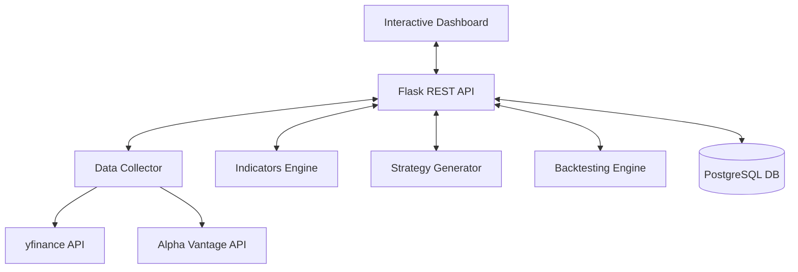

# 📈 AI Trading Strategy Agent - Technical Documentation

## Table of Contents
1. [Project Overview](#1-project-overview)
2. [System Architecture](#2-system-architecture)
3. [Component Details](#3-component-details)
4. [Installation Guide](#4-installation-guide)
5. [Configuration](#5-configuration)
6. [Usage Instructions](#6-usage-instructions)
7. [API Documentation](#7-api-documentation)
8. [Troubleshooting](#8-troubleshooting)
9. [Future Enhancements](#9-future-enhancements)
---

## 1. PROJECT OVERVIEW

### 1.1 Project Description
The **AI Trading Strategy Agent** is a production-ready financial intelligence system that automates market analysis, strategy generation, and backtesting. By combining traditional technical analysis (RSI, MACD) with Artificial Intelligence, it provides data-driven trading signals localized for the Indian market (₹/INR).

### 1.2 Key Features
*   **Multi-Source Data Engine**: Integrated with `yfinance` and `Alpha Vantage` for robust market data retrieval.
*   **Professional Visualization**: Industrial-grade interactive charts with area fills and spline smoothing.
- **AI-Powered Strategy**: Generates confidence-weighted BUY/SELL/HOLD signals using LLMs or advanced heuristic fallbacks.
- **Historical Backtester**: Instant performance verification with win rate and drawdown metrics.
- **Currency Localization**: Built-in USD to INR conversion for seamless analysis of US and Indian stocks in rupees.

### 1.3 Technology Stack
*   **Frontend**: HTML5, Vanilla CSS3 (Custom Design System), JavaScript (ES6+), Plotly.js.
*   **Backend**: Python 3.9+, Flask.
*   **Data APIs**: yfinance, Alpha Vantage API.
*   **Database**: PostgreSQL (SQLAlchemy ORM).
*   **Analysis**: Pandas, NumPy.

---

## 2. SYSTEM ARCHITECTURE

### 2.1 High-Level Architecture
The system follows a clean, modular architecture separating data, logic, and presentation:



### 2.2 Data Flow
1.  **Request**: User selects a stock and timeframe on the dashboard.
2.  **Collection**: `DataCollector` fetches raw historical data and applies INR conversion.
3.  **Analysis**: `IndicatorsEngine` calculates metrics (RSI, Bollinger Bands, etc.).
4.  **Strategy**: `StrategyGenerator` creates an AI prompt and retrieves a technical signal.
5.  **Verification**: (Optional) `Backtester` runs the strategy against historical data.
6.  **Visualization**: Flask API returns JSON to the frontend, which renders premium Plotly charts.

---

## 3. COMPONENT DETAILS

### 3.1 Data Collector (`modules/data_collector.py`)
Responsible for fetching and normalizing financial data.
*   **Key Functionalities**: 
    - Real-time USD to INR conversion.
    - Multi-source fallback (Yahoo Finance/Alpha Vantage).
    - Data caching and normalization.

### 3.2 Indicators Engine (`modules/indicators.py`)
Computes technical analysis metrics from price data.
- **Metrics**: RSI, MACD, Simple Moving Averages (20/50), Bollinger Bands.
- **Logic**: Generates individual signal states (Overbought, Bullish, etc.) for each indicator.

### 3.3 Strategy Generator (`modules/strategy_generator.py`)
Synthesizes market data and indicators into a final recommendation.
- **Key Functionalities**: 
    - Intelligent prompt engineering for AI analysis.
    - Confidence score calculation (0-10).
    - Signal logic: BUY, SELL, or HOLD based on indicator confluence.

### 3.4 Backtester (`modules/backtester.py`)
Simulates trading based on historical data to evaluate strategy performance.
- **Performance Metrics**: Total Return, Win Rate, Max Drawdown, Sharpe Ratio.

---

## 4. INSTALLATION GUIDE

### 4.1 Prerequisites
*   Python 3.9 or higher.
*   Alpha Vantage API Key (for secondary data).
*   OpenAI API Key (for enhanced AI strategies).

### 4.2 Step-by-Step Installation
**Step 1: Clone Repository**
```bash
git clone https://github.com/moditejas2005/Trading-Strategy-Agent.git
cd Trading-Strategy-Agent
```

**Step 2: Create Virtual Environment**
```bash
python -m venv venv
# Windows:
venv\Scripts\activate
# Mac/Linux:
source venv/bin/activate
```

**Step 3: Install Dependencies**
```bash
pip install -r requirements.txt
```

**Step 4: Configure Environment Variables**
Create a `.env` file in the root directory:
```env
ALPHA_VANTAGE_API_KEY=your_key_here
OPENAI_API_KEY=your_key_here
```

**Step 5: Initialize Database (Optional)**
```bash
python database.py
```

**Step 6: Run Application**
```bash
python app.py
```

---

## 5. CONFIGURATION

### 5.1 Environment Variables
*   `ALPHA_VANTAGE_API_KEY`: Required for extended intraday data.
*   `OPENAI_API_KEY`: Used for AI-driven strategy narratives.

### 5.2 Stock Symbols
The system is pre-configured with 25 diverse stocks:
*   **NSE**: RELIANCE.NS, TCS.NS, HDFCBANK.NS, etc.
*   **US**: AAPL, MSFT, GOOGL, TSLA, etc.

---

## 6. USAGE INSTRUCTIONS

1.  **Launch**: Run `python app.py` and navigate to `http://localhost:5000`.
2.  **Selection**: Use the "Stock Symbol" dropdown to pick a company.
3.  **Analysis**: Click **Analyze** to compute indicators and see the AI recommendation.
4.  **Backtest**: Click **Backtest** to see how that stock would have performed in the selected timeframe.
5.  **Navigation**: Use the interactive chart range selectors (1m, 3m, 6m, All) to zoom into specific periods.

---

## 7. API DOCUMENTATION

### 7.1 Key Endpoints
*   `GET /api/market-data?symbol=AAPL`: Returns historical price data (INR).
*   `GET /api/indicators?symbol=AAPL`: Returns computed RSI, MACD, etc.
*   `POST /api/strategy`: Generates the AI recommendation signal.
*   `POST /api/backtest`: Runs the simulation engine and returns performance stats.

---

## 8. TROUBLESHOOTING

### 8.1 Common Issues
*   **Empty Charts**: Ensure your internet connection is active (needed for `yfinance` data).
*   **ModuleNotFoundError**: Run `pip install -r requirements.txt` again in your virtual environment.
*   **Currency Error**: Check if the Yahoo Finance API is currently throttled for your IP.

---

## 9. FUTURE ENHANCEMENTS
*   **Sentiment Analysis**: Integrating news and social media sentiment.
*   **Automated Trading**: Integration with Kite or Interactive Brokers APIs for live trading.
*   **Deep Learning**: Training local LSTM models for price prediction.
*   **Mobile App**: Building a React Native companion dashboard.

---

## Appendix A: File Structure
```text
Trading-Strategy-Agent/
├── modules/
│   ├── data_collector.py     # API Integration
│   ├── indicators.py         # Technical Analysis
│   ├── strategy_generator.py # Signal Generation
│   └── backtester.py         # Simulation Engine
├── static/
│   ├── css/style.css         # Dark Theme Design
│   └── js/app.js             # UI Logic & Charts
├── templates/
│   └── index.html            # Main Dashboard
├── app.py                    # Flask API Server
└── README.md                 # Project Overview
```

---

## Appendix B: Dependencies
• flask==3.0.0
• yfinance==0.2.35
• pandas==2.1.4
• plotly==5.18.0
• alpha-vantage==2.3.1
• sqlalchemy==2.0.25
• python-dotenv==1.0.0
• psycopg2-binary==2.9.9
• pytest==7.4.4

## Appendix C: Security Considerations
• Environment variable storage for API keys (.env)
• SQL injection prevention via SQLAlchemy ORM
• Secure API key management (Gitignore enabled)
• Cross-Origin Resource Sharing (CORS) configuration
• Regular security audits recommended
• No hardcoded credentials in codebase

